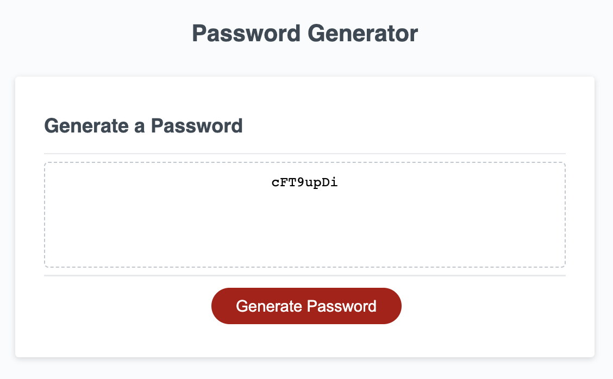

# umn-edx-password-generator

## SUMMARY
This is a simple online password generator.  When you press the "Generate Password" button, it prompts you with a series of options for the password.

First it prompts whether you would like lower case letters, upper case letters, numbers, and/or a limited set of special characters.  You must select at least one of these character types.  At least one character of each type selected is guaranteed to be in the result.

It will also ask how long the password should be.  Passwords can be anywhere between 8 and 128 characters long.

## NOTES
Ideally the selections should be made through an HTML form, but the instructions for this project explicitly required the options to be present through JS window popups.

When the character types are selected, all characters of selected types are added to a combined pool that's used to select characters for the resulting password.  Rather than rely on chance to include all selected types in the result, the code has added complexity to pick a character of each type during the selection process to inject into the result.

## LIVE VIEW
The password generator page can be viewed here: https://thinkbui.github.io/umn-edx-password-generator/

